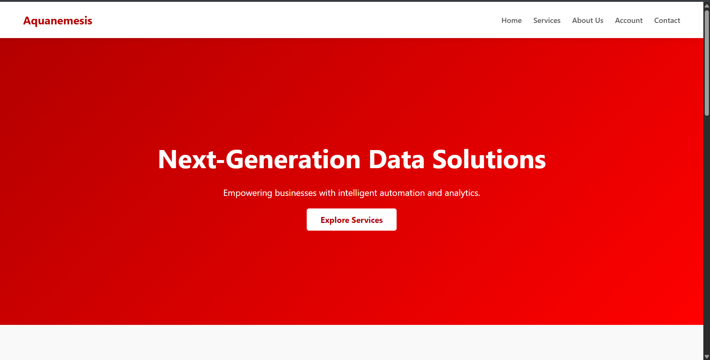
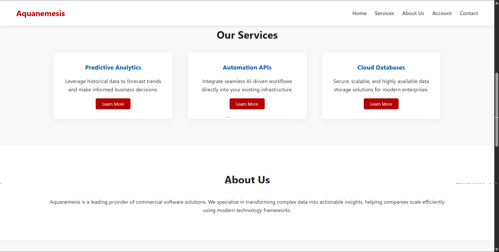
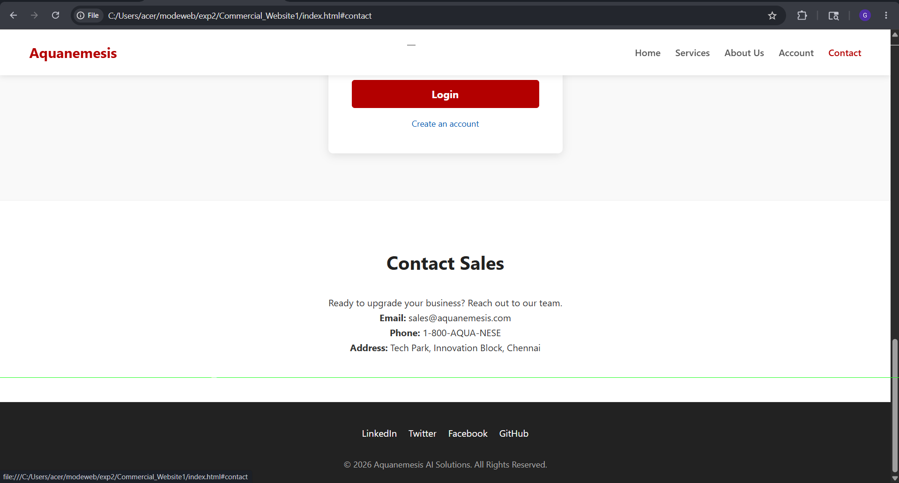

# Ex02 Commercial Website
## Date: 01-05-2026

## AIM
To create a commercial website using CSS Flexbox.

## ALGORITHM
### STEP 1
Create an HTML file (index.html)

### STEP 2
Create a CSS file (style.css)

### STEP 3
Include a navigation bar with links to different sections.

### STEP 4
Add structured sections for Homepage, Products / Services, About Us, Contact Details and User Account.

### STEP 5
Include social media links at the footer with copyright information.

### STEP 6
Define global styles for fonts, colors, and layout.

### STEP 7
Style the header, navigation bar, and sections.

### STEP 8
Use Flexbox for layout design.

### STEP 9
Add hover effects and transitions for interactivity.

### STEP 10
Add Images and Media.

### STEP 11
Use optimized images for a professional look.

### STEP 12
Open the HTML file in a browser to check layout and functionality.

### STEP 13
Fix styling issues and refine content placement.

### STEP 14
Deploy the website.

### STEP 15
Upload to GitHub Pages for free hosting.

## PROGRAM

```
index.html

<!DOCTYPE html>
<html lang="en">
<head>
    <meta charset="UTF-8">
    <meta name="viewport" content="width=device-width, initial-scale=1.0">
    <title>Aquanemesis AI Solutions</title>
    <link rel="stylesheet" href="style.css">
</head>
<body>
    <header class="flex-header">
        <div class="logo">Aquanemesis</div>
        <nav>
            <ul class="nav-links flex-nav">
                <li><a href="#home">Home</a></li>
                <li><a href="#products">Services</a></li>
                <li><a href="#about">About Us</a></li>
                <li><a href="#account">Account</a></li>
                <li><a href="#contact">Contact</a></li>
            </ul>
        </nav>
    </header>

    <section id="home" class="flex-center hero-section">
        <div class="hero-content text-center">
            <h1>Next-Generation Data Solutions</h1>
            <p>Empowering businesses with intelligent automation and analytics.</p>
            <a href="#products" class="btn">Explore Services</a>
        </div>
    </section>

    <section id="products" class="section-padding">
        <h2 class="text-center section-title">Our Services</h2>
        <div class="flex-container product-grid">
            <div class="card flex-col-center">
                <h3>Predictive Analytics</h3>
                <p>Leverage historical data to forecast trends and make informed business decisions.</p>
                <button class="btn-small">Learn More</button>
            </div>
            <div class="card flex-col-center">
                <h3>Automation APIs</h3>
                <p>Integrate seamless AI-driven workflows directly into your existing infrastructure.</p>
                <button class="btn-small">Learn More</button>
            </div>
            <div class="card flex-col-center">
                <h3>Cloud Databases</h3>
                <p>Secure, scalable, and highly available data storage solutions for modern enterprises.</p>
                <button class="btn-small">Learn More</button>
            </div>
        </div>
    </section>

    <section id="about" class="flex-center section-padding bg-light">
        <div class="about-content text-center">
            <h2 class="section-title">About Us</h2>
            <p>NovaTech is a leading provider of commercial software solutions. We specialize in transforming complex data into actionable insights, helping companies scale efficiently using modern technology frameworks.</p>
        </div>
    </section>

    <section id="account" class="flex-center section-padding">
        <div class="account-box flex-col-center">
            <h2 class="section-title">Client Portal</h2>
            <p>Sign in to access your dashboard and active services.</p>
            <form class="flex-form">
                <input type="text" placeholder="Username" required>
                <input type="password" placeholder="Password" required>
                <button type="submit" class="btn">Login</button>
            </form>
            <a href="#" class="forgot-link">Create an account</a>
        </div>
    </section>

    <section id="contact" class="flex-center section-padding bg-light">
        <div class="contact-box text-center">
            <h2 class="section-title">Contact Sales</h2>
            <p>Ready to upgrade your business? Reach out to our team.</p>
            <p><strong>Email:</strong> sales@novatech.com</p>
            <p><strong>Phone:</strong> 1-800-NOVA-TEC</p>
            <p><strong>Address:</strong> Tech Park, Innovation Block, Chennai</p>
        </div>
    </section>

    <footer class="flex-footer">
        <div class="social-links flex-row-center">
            <a href="#">LinkedIn</a>
            <a href="#">Twitter</a>
            <a href="#">Facebook</a>
            <a href="#">GitHub</a>
        </div>
        <div class="copyright">
            <p>&copy; 2026 NovaTech AI Solutions. All Rights Reserved.</p>
        </div>
    </footer>
</body>
</html>

```

```
style.css

/* Global Styles */
* {
    margin: 0;
    padding: 0;
    box-sizing: border-box;
    font-family: 'Segoe UI', Tahoma, Geneva, Verdana, sans-serif;
    scroll-behavior: smooth;
}

body {
    background-color: #f9f9f9;
    color: #333;
    line-height: 1.6;
}

/* Flexbox Utility Classes */
.flex-header {
    display: flex;
    justify-content: space-between;
    align-items: center;
}

.flex-nav {
    display: flex;
    gap: 25px;
    list-style: none;
}

.flex-center {
    display: flex;
    justify-content: center;
    align-items: center;
}

.flex-container {
    display: flex;
    flex-wrap: wrap;
    justify-content: space-around;
    gap: 20px;
}

.flex-col-center {
    display: flex;
    flex-direction: column;
    align-items: center;
    text-align: center;
}

.flex-form {
    display: flex;
    flex-direction: column;
    gap: 15px;
    width: 100%;
}

.flex-footer {
    display: flex;
    flex-direction: column;
    align-items: center;
    gap: 10px;
}

.flex-row-center {
    display: flex;
    justify-content: center;
    gap: 20px;
}

/* Specific Section Styles */
header {
    background-color: #ffffff;
    padding: 20px 50px;
    box-shadow: 0 2px 10px rgba(0,0,0,0.1);
    position: sticky;
    top: 0;
    z-index: 1000;
}

.logo {
    font-size: 1.5rem;
    font-weight: bold;
    color: #b30000;
}

.nav-links a {
    text-decoration: none;
    color: #555;
    font-weight: 500;
    transition: color 0.3s;
}

.nav-links a:hover {
    color: #b30000;
}

.section-padding {
    padding: 80px 10%;
}

.text-center {
    text-align: center;
}

.section-title {
    margin-bottom: 30px;
    font-size: 2rem;
    color: #222;
}

.bg-light {
    background-color: #ffffff;
    border-top: 1px solid #eee;
    border-bottom: 1px solid #eee;
}

/* Hero Section */
.hero-section {
    min-height: 80vh;
    background: linear-gradient(135deg, #b30000, #ff0000);
    color: white;
}

.hero-content h1 {
    font-size: 3.5rem;
    margin-bottom: 15px;
}

.hero-content p {
    font-size: 1.2rem;
    margin-bottom: 30px;
}

/* Buttons */
.btn {
    padding: 12px 30px;
    background-color: #ffffff;
    color: #b30000;
    text-decoration: none;
    border: none;
    border-radius: 5px;
    font-size: 1.1rem;
    font-weight: bold;
    cursor: pointer;
    transition: 0.3s;
}

.btn:hover {
    background-color: #e6e6e6;
}

.btn-small {
    margin-top: 15px;
    padding: 8px 20px;
    background-color: #b30000;
    color: #fff;
    border: none;
    border-radius: 4px;
    cursor: pointer;
    transition: 0.3s;
}

.btn-small:hover {
    background-color: #820000;
}

/* Cards (Services) */
.card {
    background: #fff;
    padding: 30px;
    border-radius: 8px;
    width: 30%;
    min-width: 280px;
    box-shadow: 0 4px 15px rgba(0,0,0,0.05);
    transition: transform 0.3s;
}

.card:hover {
    transform: translateY(-10px);
}

.card h3 {
    margin-bottom: 15px;
    color: #0056b3;
}

/* Account Form */
.account-box {
    background: #fff;
    padding: 40px;
    border-radius: 8px;
    box-shadow: 0 4px 15px rgba(0,0,0,0.1);
    width: 100%;
    max-width: 400px;
}

.account-box p {
    margin-bottom: 20px;
    color: #666;
}

.flex-form input {
    padding: 12px;
    border: 1px solid #ccc;
    border-radius: 4px;
    outline: none;
}

.flex-form input:focus {
    border-color: #b30000;
}

.flex-form .btn {
    background-color: #b30000;
    color: white;
}

.flex-form .btn:hover {
    background-color: #820000;
}

.forgot-link {
    margin-top: 15px;
    color: #0056b3;
    text-decoration: none;
    font-size: 0.9rem;
}

/* Footer */
footer {
    background-color: #222;
    color: #aaa;
    padding: 40px 20px 20px;
}

.social-links a {
    color: #fff;
    text-decoration: none;
    transition: color 0.3s;
}

.social-links a:hover {
    color: #ff0000;
}

.copyright {
    margin-top: 20px;
    font-size: 0.9rem;
}

```

## OUTPUT








## RESULT
The program for creating commercial website using CSS Flexbox is executed successfully.
